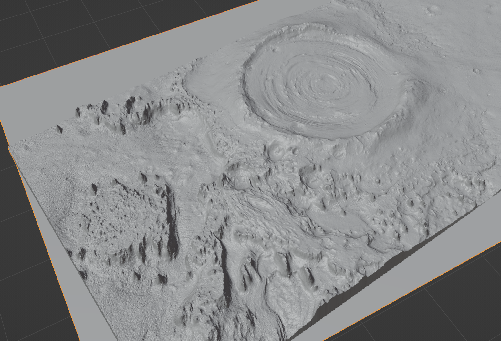

# HIRISE Blender

Source code for the HIRISE Blender add-on.

## About HIRISE
[HIRISE](https://www.uahirise.org/) (High Resolution Imaging Science Experiment) is the most powerful camera ever sent to another planet, one of six instruments onboard the Mars Reconnaissance Orbiter. There are several data products derived from the instrument, the one we want to use is the "Digital Terrain Model" or DTM.

> HiRISE DTMs are made from two images of the same area on the ground, taken from different look angles. Creating a DTM is complicated and involves sophisticated software and a lot of time, both computing time and human operator time.  The great advantage of a HiRISE DTM is the high resolution of the source images. As a general guide, terrain can be derived at a post spacing about 4 times the pixel scale of the input images. HiRISE images are usually 0.25 - 0.5 m/pixel, so the post spacing is 1-2 m with vertical precision in the tens of centimeters.  
[source](https://www.uahirise.org/dtm/about.php)

This plugin lets you directly import the DTM files, saved in the IMG format. It contains all libraries as direct imports, simplifying the install process, and provides a handy file menu for easy access.

### Other Sources

In theory you can use this addon to import any Planetary Data System (PDS) IMG file. For instance, the PDS IMG files of the Moon can be found [here](https://wms.lroc.asu.edu/lroc/rdr_product_select?filter%5Btext%5D=&filter%5Blat%5D=&filter%5Blon%5D=&filter%5Brad%5D=&filter%5Bwest%5D=&filter%5Beast%5D=&filter%5Bsouth%5D=&filter%5Bnorth%5D=&filter%5Btopographic%5D=true&show_thumbs=1&per_page=10&commit=Search). Results are only guaranteed for the HIRISE data though, for now.

## Installation
Download the .zip from the [releases](https://github.com/dcellucci/hirise-blender/releases/) and install as you would a [typical Blender add-on](https://docs.blender.org/manual/en/latest/editors/preferences/addons.html#installing-add-ons)

## Testing
Find yourself a cool, mega-detailed HIRISE DTM file and download it (I like [this one](https://www.uahirise.org/dtm/PSP_001981_1825))

Select `File -> Import -> HIRISE .IMG` and select your file. 

## Enjoy

Enjoy your new detailed mesh of Mars!

## Import Options
There are a few options to note

### Pixels Per Grid Square
This effectively downsamples the original IMG file when creating the mesh. A single grid square in the mesh will correspond to this many pixels in the original data.

Note that this will directly relate to import time and memory usage. **Going below 4 PPGS might cause a memory error so that's why we have the safety option below**

### Safety
You must check the safety box if you select a PPGS below 4. This is for the best. 

### Quads
Select quads or tris for the mesh face. Defaults to quads.